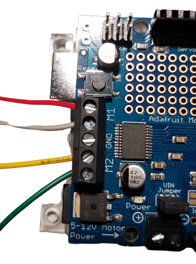
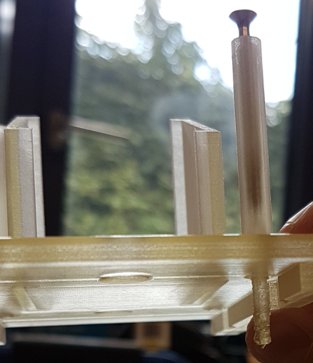

# CCP Bead Dispenser

**A DIY USB powered bead dispenser**

> Arduino sketch that accepts user input (i.e., an integer) and then starts a Nema 14 stepper motor. While the motor rotates, the attached infrared beam module counts objects which break the beam. The motor will stop when the object count equals the provided number by the user. This repo includes 3d stl files and a construction manual.

---

- [CCP Bead Dispenser](#ccp-bead-dispenser)
  - [Demo](#demo)
  - [Overview](#overview)
    - [Power Supply](#power-supply)
    - [What’s happening](#whats-happening)
      - [Software](#software)
      - [Hardware](#hardware)
  - [Hardware Components](#hardware-components)
  - [Construction Manual](#construction-manual)
    - [Soldering Adafruit Shield on the Arduino](#soldering-adafruit-shield-on-the-arduino)
    - [Wiring the Stepper Motor on the Adafruit Shield](#wiring-the-stepper-motor-on-the-adafruit-shield)
      - [Check which coils make a pair](#check-which-coils-make-a-pair)
      - [Connect the Motor to the Shield](#connect-the-motor-to-the-shield)
    - [IR Breakbeam Sensors Connection](#ir-breakbeam-sensors-connection)
      - [Add DuPont Connectors to the wires](#add-dupont-connectors-to-the-wires)
    - [Connect IR Breakbeam Sensors](#connect-ir-breakbeam-sensors)
    - [Threading](#threading)
    - [Disk Treatment](#disk-treatment)
  - [3D Components Overview](#3d-components-overview)

---

## Demo

https://user-images.githubusercontent.com/9831678/168770235-a08dd8c6-3110-4d33-b17b-d08c474d0a74.mp4

## Overview

This DIY bead dispenser was used as a companion apparatus for [Sarah Pope-Caldwell’s](https://sarahmichellepope.com/) _Nifty Shifty_ Game Battery. Specifically, the dispenser receives a signal (i.e., a positive integer) from the game, which starts a NEMA 14 stepper motor releasing the number of requested beads. The Arduino sketech was developed by [Steven Kalinke](https://www.eva.mpg.de/de/comparative-cultural-psychology/staff/steven-kalinke/).

Initially, [Dylan T Guenther](https://neurology.ufl.edu/profile/guenther-dylan/) provided us with his modifications from [thingiverse](https://www.thingiverse.com/thing:1771176), and then Raik Pieszek made significant modifications to meet our requirements. You will find all the `stl` files within the repository’s [`stl` directory](./stl/).

### Power Supply

We are aware the stepper motor and infrared beams are underpowered by the low voltage/current constraints of the USB 2 protocol (i.e., 5V @ 0.5A). However, throughout the entire hardware engineering process, we tested the dispenser to run with standard USB 2.0 power only and have not observed any drawbacks by under-powering it. The dispenser was also running in high humidity conditions (Congo) for approx. 8h per day over five to six weeks conducted by [Elisa Felsche](https://www.eva.mpg.de/comparative-cultural-psychology/staff/elisa-felsche/). Please refer to the [hardware components](#hardware-components) sections for further details.

### What’s happening

As of Summer 2022, we will work on a version 2 with some soft- and hardware improvements, which are listed below:

#### Software

Check the [issue tab](https://github.com/ccp-eva/bead-dispenser/issues) for open issues!

#### Hardware

- [ ] Use Gewindemuffen, -hülse, or Stangenmutter to replace the plastic pillows, Or better use Gewindestifte/Madenschrauben (M5/60mm) (https://www.fenau.eu/gewindeterminal-mit-innengewinde-linksgewinde-fuer-seil-von-o-3-mm-bis-o-8-mm-v2a.html)
- [ ] Make a design, that allows flexible adjustment for the disk hole sizes
- [ ] Heat space for stepper motor
- [ ] Motor Thron
- [ ] Universal mount for the flexible funnel sizes

## Hardware Components

<!-- prettier-ignore -->
| Component                                                                   | Description                                                                                                                                                                                                                                                                                                 | Approx. Price |
| --------------------------------------------------------------------------- | :---------------------------------------------------------------------------------------------------------------------------------------------------------------------------------------------------------------------------------------------------------------------------------------------------------- | ------------- |
| Arduino Uno                                                                 | https://www.amazon.com/Arduino-A000066-ARDUINO-UNO-R3/dp/B008GRTSV6                                                                                                                                                                                                                                         |               |
| Adafruit Motor Shield (2.3)                                                 | https://www.amazon.com/Adafruit-Motor-Stepper-Shield-Arduino/dp/B00PUTH3B0                                                                                                                                                                                                                                  |               |
| … alternatively version 2.0 (cheaper)                                       | https://www.roboter-bausatz.de/p/motor-shield-v2.0-fuer-arduino?sPartner=8&gclid=CjwKCAjw1JeJBhB9EiwAV612y0uTo-yNJ4GlXUTTYTJsgV14ZZIoj7A12Il0sJB5pGVDDNJmeDUyexoCM9cQAvD_BwE                                                                                                                                |               |
| Stepper Motor (Nema 14) Option 1                                            | Polou SY35ST28-0504A (200 steps / 1.8°, 0.1Nm holding torque, 10V @ 0.5A, 20Ω Phase resistance) – [Datasheet](https://www.pololu.com/file/0J688/SY35ST28-0504A.pdf) – https://www.robotshop.com/de/de/10-v-05-a-13-oz-in-zweipoliger-schrittmotor.html                                                      |               |
| Stepper Motor (Nema 14) Option 2                                            | Joy-it Nema14-01 (200 steps / 1.8°, 0.1Nm holding torque, 8V @ 0.4A, 20Ω Phase resistance) — [Datasheet](https://joy-it.net/en/products/NEMA14-01) — https://joy-it.net/en/products/NEMA14-01 or https://www.conrad.de/de/p/joy-it-schrittmotor-nema14-01-0-1-nm-0-4-a-wellen-durchmesser-5-mm-2142507.html |               |
| Adafruit IR Beam Break Sensor Pair (3mm, preferably with DuPont Connectors) | https://www.mouser.de/ProductDetail/Adafruit/2167?qs=GURawfaeGuCJ0J7vogtCzg%3D%3D                                                                                                                                                                                                                           |               |
| USB Wire (Type B from the Arduino to whatever you need on your computer)    | Note, we had some difficulties with USB Adapters, a direct connection is preferred, e.g., USB C to Type B: [USB-Kabel USB 2.0 USB-B Stecker](https://www.conrad.de/de/p/manhattan-usb-kabel-usb-2-0-usb-b-stecker-usb-c-stecker-2-00-m-schwarz-2356814.html)                                                |               |
| Pellets                                                                     | We tested a variety of beads/pellets. A rule of thumb: beads should be a non-reflective surface, as the IR signal can be reflected around the pellet. Wood is good material; we used these wood balls: https://www.holz-allerlei.de/holzkugeln-ohne-bohrung/143/holzkugeln-6-mm-oe-ohne-bohrung?c=34        |               |
| Soldering Iron                                                              |                                                                                                                                                                                                                                                                                                             |               |
| Crimp tool and DuPont Connectors                                            | … to easily connect the IR beam break sensors                                                                                                                                                                                                                                                               |               |
| Threading tap to create threads                                             | … for screws and nuts (M4)                                                                                                                                                                                                                                                                                  |               |

## Construction Manual

### Soldering Adafruit Shield on the Arduino

- [Documentation](https://learn.adafruit.com/adafruit-motor-shield-v2-for-arduino/install-headers)
- [Guide](https://learn.adafruit.com/adafruit-motor-shield-v2-for-arduino/install-headers#installing-with-stacking-headers-405903-16)

- Place the Shield stacking headers on the Adafruit shield (terminals are optional for this setup) and solder them at the bottom of it.
- You may need to buy stacking headers as the Adafruit shield does not come with them (it did actually for our case)

  
   
  Soldering stacking headers to the Motorshield (they may come pre-solderd for Motor Shield v.2.3)

### Wiring the Stepper Motor on the Adafruit Shield

#### Check which coils make a pair

Either use a Multimeter and figure out the two wires having the lowest resistance, those make a coil pair. If you do not have a Multimeter, connect their wire tips: Now turn the stepper motor: If the rotation resistance is high, then the two cables belong together (i.e., making a coil pair).

#### Connect the Motor to the Shield

  
   
  Left: Polou SY35ST28-0504A (M1: black, green; M2: red, blue). Right: Joy-it Nema14 (M1: red, gray; M2: yellow, green).

### IR Breakbeam Sensors Connection

Docs & Datasheet: https://www.adafruit.com/product/2167

  
  
  Left Image: The receiver is on the left, it has three wires. The transmitter is on the right, it has two wires

#### Add DuPont Connectors to the wires

If your IR break beam sensors came with DuPont (see [JST connector - RE](https://en.wikipedia.org/wiki/JST_connector)) connectors you can skip this step. If not, use a crimp tool to add crimps.

  
  
  Left: IR Breakbeam Sensors w/o DuPont Connectors. Right: IR Breakbeam Sensors w/ DuPont Connectors.

### Connect IR Breakbeam Sensors

The **receiver** (photodiode/sensor) has **three** colored wires; connect the

- **black** wire to the ground (there are two, which one doesn’t matter)
- **red** wire to the 5V Pin (**_important!_**)
- **white** wire to Pin 4 in the Digital I/O array

The **transmitter LED** (sender) has **two** colored wires; connect the

- **black** wire to the ground (the one that is left)
- **red** wire to the 3V Pin (**_important!_**)

### Threading

Use **M4 threading taps** for the following 3D components:

<!-- prettier-ignore -->
|  |  |
|-|-|
| The four columns from the **roof** print-out (you may need to get rid of some residuals from the print before). Use a screw (or whatever) to push out residuals from the print. Thread after cleaning. |  |
| The four holes from the **dispenser** holes |  |
| The side of the dispenser. Drill an M4 thread in the side of the dispenser as a fixation for the IR beam breaker |  |
| Finally, drill an M4 thread in the IR break beam transmitter & receiver (this will be screwed together with the dispenser later.  |  |

### Disk Treatment

- Depending on the 3D printer the bottom of the disk may be a bit rough, and therefore creating resistance. Use fine sandpaper.
- Depending on the 3D printer the disk’s hole may be too narrow for the stepper motor’s D-shaft. Roll a thin layer of sand paper to increase the inner diameter.

  
   
  Left: Increase inner disks diameter. Right: Sand paper the bottom of the disk.

## 3D Components Overview

Our model is composed of seven components, these are from bottom to top:

- Box
- Slide
- Door
- Roof
- Dispenser
- Disk
- Funnel

<!-- prettier-ignore -->
| Component | STL File | Isometric Preview |
|-|-|-|
| **Box** — Housing for the Arduino & Adafruit Shield | [Download](stl/box.stl) |  |
| **Slide** — To fixate the Arduino’s plate with the slide | [Download](stl/slide.stl) |  |
| **Door** — Sliding door that closes the box | [Download](stl/door.stl) |  |
| **Roof** — Coveres the box, and provides a housing for a NEMA 14 stepper motor | [Download](stl/roof.stl) |  |
| **Dispenser** — Holding the disc and provides a tube | [Download](stl/dispenser.stl) |  |
| **Disk** — Revolving magazine to release beads or other objects | [Download](stl/disk.stl) |  |
| **Funnel** — Bead funnel/storage unit | [Download](stl/funnel.stl) |               |
| **Lid** — Get yourself some Pringles. Use the Pringle’s lid to seal the funnel. (optional) | — |  |
